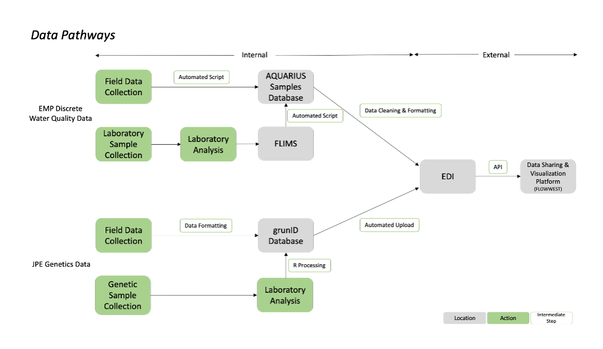

## Purpose

The Downstream Dashboard is a collaboration between California Department of Water Resources (DWR) data collection programs to support [open data](https://water.ca.gov/ab1755) access and visualization in alignment with the [Open and Transparent Water Data Act (AB 1755, Dodd)](https://leginfo.legislature.ca.gov/faces/billNavClient.xhtml?bill_id=201520160AB1755).

The [Environmental Data Initiative (EDI)](https://edirepository.org/) is used as a public repository where datasets can be downloaded. Although data are available in non-proprietary, machine-readable formats does not mean the data are accessible to all users. This dashboard makes data more accessible by providing data visualizations and exploration tools.

**This dashboard supports:**

-   Visualizing and exploring data using open-source tools
-   Demonstrating a reproducible workflow for data publication and access

{width="570"}

## Data collection programs

### EMP Discrete Water Quality

The Environmental Monitoring Program (EMP) monitors water conditions across the San Francisco Estuary to understand long-term ecosystem health.

-   **24 fixed stations** sampled monthly at high water slack tide

-   Samples collected for physical parameters (e.g., temperature, pH) and laboratory analysis (e.g., nitrogen, phosphorus)

-   Accessed via the Research Vessel Sentinel or vehicle transport for shore-based stations

### SR JPE Genetics

The Spring-Run Juvenile Production Estimate (SR JPE) project monitors the seasonal outmigration of threatened juvenile spring-run Chinook salmon.

-   **11 monitoring sites** across the Sacramento River Basin, sampled November–May

-   Genetic techniques (CRISPR-based SHERLOCK, GT-seq) used to distinguish spring-run Chinook from co-occurring runs (Fall, Late Fall, Winter)

-   [Spring-Run Chinook Salmon JPE Run Identification Program Research and Initial Monitoring Plan](https://water.ca.gov/-/media/DWR-Website/Web-Pages/Programs/State-Water-Project/Endangered-Species-Protection/SR-JPE-Run-ID-Program-Development-Plan-2023-08-Update.pdf)

## Data management and publication

All data is stored internally and published to the [Environmental Data Initiative (EDI)](https://edirepository.org/).

-   Dashboard pulls data directly from EDI for visualization

-   Dashboard developed using **R Shiny** and all code is available on [GitHub](https://github.com/SRJPE/data-dock)

{width="651"}

## Roles and responsibilities

-   For questions about the SR JPE Genetics Data, please contact Sean Canfield (sean.canfield\@water.ca.gov)
-   For questions about the EMP Discrete Water Quality Data, please contact Morgan Battey (morgan.battey\@water.ca.gov)
-   Dave Bosworth is responsible for ongoing maintenance of the Downstream Dashboard (david.bosworth\@water.ca.gov)
